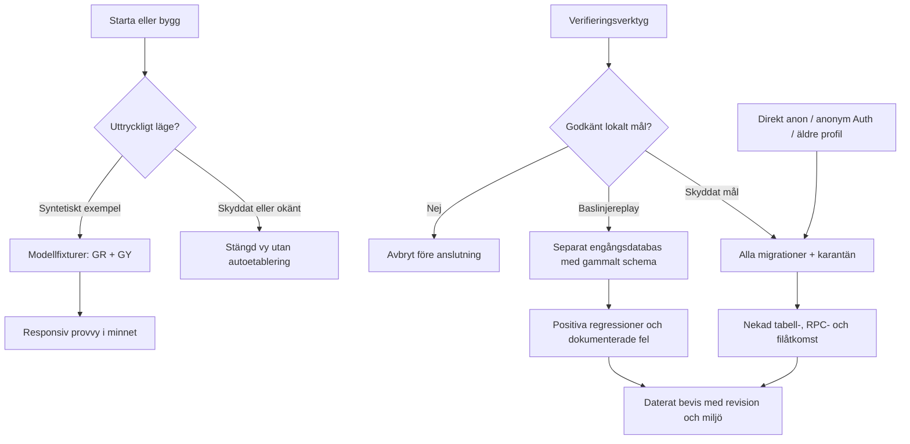

# Phase 1: Baslinje och avskild pilotmiljö - Research

**Researched:** 2026-09-11
**Domain:** Återställbar befintlig app, syntetisk provmiljö och stängda Supabase-datavägar.
**Confidence:** HIGH för nuläge och verifierade verktygsfunktioner; MEDIUM för ännu oprövad lokal uppsättning.

<user_constraints>
## User Constraints (from CONTEXT.md)

Följande beslut, tekniska friheter och senarelagda idéer återges ordagrant ur `01-CONTEXT.md`. [VERIFIED: .planning/phases/01-baslinje-och-avskild-pilotmilj/01-CONTEXT.md]

### Locked Decisions

### Pilotens upplägg — användarens val i denna diskussion

- **D-01:** Ingen pilotpartner är vald. Börja med en fristående provmiljö; ange framtida skola, huvudman eller kommun som öppet beroende.
- **D-02:** Provmiljön ska spegla både grundskola och gymnasium, med en egen exempelskola för respektive skolform.
- **D-03:** Provmaterialet ska vara överskådligt: några klasser per skola, med tydliga exempel på elever, utbildningar och timplaner. Inget exakt elevantal är beslutat. Exempelstorleken är varken verklig pilotvolym eller appens framtida kapacitetsgräns.
- **D-04:** Användaren ska själv kunna prova på dator och telefon i första steget. Inga andra testpersoner är planerade nu.
- **D-05:** Användaren valde att avsluta diskussionen och sammanställa besluten efter genomgången av pilotens upplägg. Områdena fortsatt provning och granskning av baslinjen fick ingen separat fördjupning; nedanstående redan beslutade krav gäller även där.

### Redan beslutade ramar — från projektet och den godkända färdplanen

- **D-06:** Provmiljön använder syntetiska uppgifter. Aktuella kund-, register-, identitets- och driftbeslut får inte ersättas med påhittade integrationsbesked.
- **D-07:** Bevara gymnasiets skapande av utbildningar, tillägg av kurser/nivåer, fristående kopior till nästa elevkull och explicita klasskopplingar till fastställda timplansversioner. Kopiering till ny kull flyttar inte befintliga elever. Grundskolans motsvarande tillämpliga arbetsflöden ska också kunna prövas.
- **D-08:** Baslinjen ska omfatta granskade appkällor och databasdefinitioner och kunna återställas. Befintligt användarskapat material ska bevaras; förekomst av data i ett anslutet projekt är inte tillstånd att återställa eller tömma det.
- **D-09:** Avskiljningen omfattar klientens startväg, databasanslutning, installerad demoetablering och automatisk exempeldata. Demoåtkomst ska inte ge rättigheter till pilotens skyddade datavägar. Det fullständiga identitets- och mandatflödet hör till fas 2–3.
- **D-10:** Pilotprofilen ska vara daterad och skilja bekräftade val, syntetiska exempel, förslag och öppna beroenden. Organisation, elevfält, originalkälla, skrivansvar och verklig volym ska framgå även när ett värde ännu inte är bestämt.

### Codex discretion

Rutintekniska val hanteras av researcher och planner enligt projektets arbetssätt. De är inte särskilt låsta användarval från denna diskussion.

- Bestäm exakt antal syntetiska elever och klasser inom ett överskådligt exempel, samt fiktiva namn och stabila exempel-ID:n. Utgå från en syntetisk huvudman med de två exempelskolorna; ytterligare isolerade fixturer för åtkomstprov kan finnas utanför användarens vanliga provvy.
- Föreslå minsta användbara uppsättning elev- och placeringsfält för provmaterialet. Märk dem som föreslaget underlag för senare registerarbete; en framtida kommuns fält och skrivansvar är öppna.
- Välj hur utvecklings-/demoläge och den avskilda provmiljön görs tydliga och reproducerbara. Återanvänd befintlig responsiv webb och telefonförhandsvisning där det fungerar; ingen ny distributionsplattform eller extern publicering är beslutad.
- Välj testverktyg, fixturhantering, baslinjemärkning och dokumentstruktur. Baslinjerapporten ska visa prövat arbetsflöde, miljö/version, resultat och kvarstående fel med användbara hänvisningar.
- Ta ställning till kodkartans sparnings- och transaktionsrisker i fasplaneringen. Dokumentera och reproducera relevanta fel i avskild miljö; gör inte ett känt fel till godkänd funktion genom enbart bevarandetest. En större rättning ska ha uttryckligt ägarskap inom godkänd fas eller dokumenterad senare hantering.

### Deferred Ideas (OUT OF SCOPE)

Inga nya funktioner tillkom i diskussionen. Följande kvarstår inom den redan godkända milstolpens senare arbete:

- Verklig pilotpartner, IdP, kontokälla och elevregisterleverantör är ännu inte valda. Fas 1 dokumenterar beroendena; faktisk anslutning godkänns i fas 7.
- Verkliga elevuppgifter och pilotdrift följer kundens senare beslut och fas 8:s villkor.
- Andra testpersoner och publik tillgång ingår inte i det valda första provupplägget.
- Slutlig pilotvolym, elevfält och källornas skrivansvar fastställs när en partner och ett verkligt flöde är valt. Syntetiska antaganden får inte presenteras som kundöverenskommelser.
- Fortsatt provning och granskning av baslinjen valdes inte för separat fördjupning. Deras redan godkända krav i BASE-01 och BASE-02 kvarstår.
</user_constraints>

## Summary

Fasen bör ge två tydliga resultat: en användbar syntetisk provvy utan databasanslutning, och ett separat lokalt databasmål där skyddade vägar är stängda tills fas 2 öppnar verifierad kontoåtkomst. Detta är en rekommenderad avgränsning inom D-06/D-09, inte en ny inloggningsmodell. Dagens vanliga laddning anropar demoetablering och kan skapa eller radera exempeldata; den kan därför inte återanvändas oförändrad i skyddat läge. [VERIFIED: 01-CONTEXT.md; web/lib/supabase.ts; web/lib/organisation-store.ts:246; web/lib/planning-store.ts:88,244]

Versionshantera först granskade källor, låsfil, migrationer och nödvändiga verktyg. `git ls-files web supabase work` gav inga filer vid denna research. Återställningsprovet måste därför omfatta faktisk appkod, inte bara GSD-dokument. Positiva databasprov av den gamla appen ska ske i en separat avsiktlig engångsmiljö; öppna aldrig den skyddade målmiljön för att få ett gammalt demoprov att passera. [VERIFIED: git ls-files 2026-09-11; AGENTS.md; 01-CONTEXT.md D-08]

**Primary recommendation:** planera i ordningen källbaslinje → uttryckliga provlägen/fixturer → lokal karantän och negativa databasprov → dokumenterade regressioner/anslutningsprofil. Behåll befintlig teknik; fullständiga identiteter, skolmandat och elevpersistens hör till senare faser. [VERIFIED: .planning/ROADMAP.md Phase 1–4; 01-CONTEXT.md]

## Architectural Responsibility Map

Tabellen är rekommenderad ansvarsfördelning utifrån de verifierade kodgränserna. [VERIFIED: .planning/codebase/ARCHITECTURE.md; web/lib/supabase.ts; supabase/migrations/]

| Capability | Primary Tier | Secondary Tier | Rationale |
|---|---|---|---|
| Syntetiska skolor, elever och arbetsflöden | Browser / Client | Modellfabriker | Exempel utan backend; ingen ny beständig elevmodell i fas 1. |
| Val av bygg-/startläge och anslutning | Bygg-/startverktyg | Browser / Client | Publika värden bäddas in av Vinext; startkontroll måste ske före klientbygge. |
| Nekad skyddad dataåtkomst | Database / Storage | Supabase API/Auth | Ändrade webbläsarflaggor får inte återöppna tabeller, RPC eller filer. |
| Återspelning och syntetisk etablering | Lokalt CLI/testverktyg | Database / Storage | Endast särskilt skapade lokala mål; inga privilegierade nycklar till webbläsaren. |
| Baslinje och anslutningsprofil | Git + dokument | Verifieringsrapporter | Revision, miljö och resultat behöver kunna granskas och återställas. |

<phase_requirements>
## Phase Requirements

Kravtexten kommer från godkända REQUIREMENTS.md. [VERIFIED: .planning/REQUIREMENTS.md]

| ID | Description | Research Support |
|---|---|---|
| BASE-01 | Projektansvarig kan återgå till en versionshanterad baslinje för den befintliga appen och se vilka uppskattade arbetsflöden som passerar dokumenterade regressionsprov. | Källinventering, Git-arkiv i separat katalog, fyra användarflöden, lokal databasreplay och daterad resultatmatris. |
| BASE-02 | Pilotansvarig kan använda en avskild test-/pilotmiljö där anonym demoetablering och automatisk exempeldata inte kan ge åtkomst till skyddade driftvägar. | Ingen Supabase-klient i exempelvy, stängd grundinställning, nya migrationsrättigheter, separat Storage-skydd och negativa direkta anrop. |
| PILOT-01 | Pilotansvarig kan granska en daterad anslutningsprofil med ansvarig organisation, valda elevuppgifter, originalkälla och skrivansvar, pilotvolym samt öppna kund- och leverantörsberoenden. | Fältvis status/ursprung/ägare och öppna beroenden; fixtureantal redovisas separat från verklig volym. |
</phase_requirements>

## Project Constraints (from AGENTS.md)

`CLAUDE.md`, `.claude/skills/`, `.agents/skills/` och `.planning/graphs/graph.json` finns inte i den undersökta arbetsytan. Inga ytterligare projektregler eller grafrelationer har därför tillförts. [VERIFIED: filesystem existence checks 2026-09-11]

- Bevara gymnasieutbildning, kurs-/nivåtillägg, ny kull och fasta klass–timplansversioner; prova grundskolans tillämpliga flöden. [VERIFIED: AGENTS.md; 01-CONTEXT.md D-07]
- Paketkommandon körs i `web/`. Vid kodändring: relevanta modelltester, typkontroll, riktad lint och bygge; vid UI-ändring även dator/telefon. Historiska resultat är inte nya bevis. [VERIFIED: AGENTS.md]
- Hemligheter/personuppgifter får inte hamna i Git eller rapporter. Granska filer före baslinjecommit; inkludera inte befintliga lokala miljöfiler. [VERIFIED: AGENTS.md; .gitignore; web/.gitignore]
- Databasskript i `work/supabase/` skriver data; `reset.mjs` är destruktivt. Varken konfigurerad anslutning eller känd nyckel är tillstånd att återställa befintlig data. [VERIFIED: AGENTS.md; 01-CONTEXT.md D-08; .planning/codebase/TESTING.md]
- HM utser rektor, rektor tilldelar lärare. Exempelrollen är inget servermandat. Skolverkets uppslag ger skoluppgifter, inte företrädarbehörighet. [VERIFIED: AGENTS.md]
- Befintlig research om informationshantering är underlag; ingen publik diarietjänst eller ny juridisk deadline införs i denna fas. [VERIFIED: AGENTS.md; .planning/research/PITFALLS.md]

## Standard Stack

Behåll appens låsfil. Aktuell registryversion är inte skäl att samtidigt uppgradera React/Vite/Supabase i en baslinjefas. Npm-versioner och publiceringsdatum nedan hämtades med `npm view <package> version time --json` 2026-09-11. [VERIFIED: npm registry; web/package-lock.json]

### Core

| Library | Version att använda | Registry vid research / publiceringsdag | Purpose |
|---|---|---|---|
| Node.js | 24.19.0, verifierad lokal runtime | Ej npm-beroende | Kör TS-importerna i befintlig `node:test`-svit. [VERIFIED: local node --version; .planning/codebase/TESTING.md] |
| React | Låst 19.2.8, publicerad 2026-07-21 | 19.3.0 / 2026-09-09 | Befintliga komponenter. [VERIFIED: npm registry; web/package-lock.json] |
| Vinext | Låst 1.0.0-beta.9 | Samma / 2026-09-02 | Befintligt bygge och Worker-mål. [VERIFIED: npm registry; web/package-lock.json] |
| Vite | Låst 8.2.2, publicerad 2026-08-20 | 8.3.0 / 2026-09-10 | Befintlig byggkedja. [VERIFIED: npm registry; web/package-lock.json] |
| Supabase JS | Låst 2.115.0, publicerad 2026-09-03 | 2.116.0 / 2026-09-07 | Befintliga datalager och direkta API-prov. [VERIFIED: npm registry; web/package-lock.json] |

### Supporting

| Library | Version | Purpose | När |
|---|---|---|---|
| `node:test` + `node:assert/strict` | Inbyggt i vald Node 24 | Modell-, läges- och fixturtester | Återanvänd befintligt format. [VERIFIED: web/lib/cohort-model.test.mjs] |
| `@playwright/test` | Föreslagen exakt 1.63.0, publicerad 2026-09-04; registry latest | Reproducerbara dator-/telefonflöden och nätverkskontroll | Nytt avgränsat testberoende; installera dess egna webbläsare. [VERIFIED: npm registry; web/package.json] |
| Supabase CLI | Befintlig 2.78.1, publicerad 2026-03-10 | Lokal migration och pgTAP | Dokumentera/pinna använd version; latest är 2.117.0 från 2026-09-07, uppgradering ingår inte automatiskt. [VERIFIED: supabase --version; npm registry] |
| PostgreSQL + pgTAP | Lokal Supabase-konfiguration anger PostgreSQL 17 | Riktiga privilegie-/policyprov | Faktisk serverversion/pgTAP-version registreras när containrar startas. [VERIFIED: supabase/config.toml; supabase test db --help] |

**Installation — förslag för exekveringen, inte kört i research:**

```bash
# Från web/, med Node 24 aktiv i PATH.
npm ci
npm install --save-dev --save-exact @playwright/test@1.63.0
npx playwright install chromium webkit
```

### Alternatives Considered

- Behåll befintlig gemensam molndemo separat som befintligt material. Den väljs inte som testmål eftersom laddning och skript kan skriva/radera dess uppgifter. [VERIFIED: web/lib/organisation-store.ts; work/supabase/reset.mjs; AGENTS.md]
- Enbart mockad Supabase är användbart för svarordning och för att upptäcka oväntade anrop, men kan inte verifiera installerade SQL-privilegier. Använd både isolerade transportprov och lokal databas. [VERIFIED: .planning/codebase/TESTING.md; supabase/migrations/20260905130000_demo_bootstrap.sql]
- Inför inte Vitest/Jest eller nytt serverramverk i denna fas; Node-testverktyget och det befintliga SQL-lagret räcker som grund, med Playwright för saknad browsernivå. Detta är en omfattningsrekommendation. [VERIFIED: web/package.json; .planning/ROADMAP.md Phase 1]

## Architecture Patterns

### System Architecture Diagram

Rekommenderat flöde; strecket mellan lokala databasmål är en faktisk separat miljögräns. [VERIFIED: 01-CONTEXT.md D-08/D-09; .planning/codebase/ARCHITECTURE.md]



### Rekommenderad filfördelning

Detta är föreslagna nya filer, inte påståenden om vad som redan finns. Anpassa namnen till planernas ägarskap. [VERIFIED: .planning/codebase/STRUCTURE.md; 01-CONTEXT.md Codex discretion]

| Fil/område | Ansvar |
|---|---|
| `web/lib/runtime-mode.ts` + `.test.mjs` | Rent kontrakt för `example`/`protected`, ogiltig konfiguration och när klient får skapas. |
| `web/lib/pilot-fixtures.ts` + `.test.mjs` | Sammanhängande, stabila exempel-ID:n över organisation, elever, grupper och planer. |
| `web/scripts/run-mode.mjs` | Uttryckliga miljövärden för dev/bygge; inga ärvda molnnycklar i exempelbygge. |
| `work/pilot/prepare-local.mjs` | Skapar separata lokala arbetskataloger/manifest för `baseline` och `protected`; vägrar fjärrmål. |
| `work/pilot/verify-target.mjs` | Kontrollerar miljön innan varje potentiellt skrivande databasprov. |
| `supabase/migrations/<timestamp>_quarantine_demo_access.sql` | Stänger installerade rättigheter utan att radera användardata. |
| `supabase/tests/phase1_isolation.test.sql` | SQL-prov av faktiska privilegier, RPC, befintlig demoidentitet och Storage. |
| `work/pilot/verify-isolation.mjs` | Negativa direkta API-prov mot skyddat lokalt mål. |
| `web/e2e/phase1-*.spec.ts`, `web/playwright.config.ts` | Arbetsflöden, lägesgräns och dator-/telefonprojekt. |
| `docs/pilot/baseline.md`, `docs/pilot/connection-profile.md` | Återgång, resultat, källansvar och öppna beslut. |

### Pattern 1: Tydligt läge innan någon anslutning skapas

Vinext läser `.env.local` och fyller `process.env`; dess plugin bäddar in `NEXT_PUBLIC_*`. Redan satta processvärden går före miljöfiler. Vites dokumentation bekräftar att klientexponerade miljövärden ersätts vid bygge. [VERIFIED: web/node_modules/vinext/dist/config/dotenv.js; CITED: https://vite.dev/guide/env-and-mode]

**Gör:** skapa uttryckliga skript för exempelbygge/-start. Sätt läge samt båda Supabase-variablerna uttryckligen till tomma värden i underprocessen för exempelbygget; att bara ta bort dem kan låta `.env.local` fylla tillbaka dem. `supabase()` ska returnera `null` innan `createClient` i exempelvägen. Saknat/okänt läge ska ge stängt läge och begriplig konfigurationsstatus, inte automatiskt välja gemensam molndemo. Prova även det byggda resultatet, inte bara devservern. [VERIFIED: web/lib/supabase.ts; web/node_modules/vinext/dist/config/dotenv.js; 01-CONTEXT.md D-09]

**Gör:** låt skyddat läge vara stängt i fas 1. Ta bort `signInDemo` och automatisk seedning ur de vanliga laddarna; inga data skrivs av tomma läsresultat. Testet ska anropa riktiga laddarfunktioner med kontrollerad transport och bevisa att varken `signInAnonymously`, bootstrap, insert/upsert eller bred delete sker. Att endast testa en boolesk hjälpare räcker inte. [VERIFIED: web/lib/organisation-store.ts:246; web/lib/planning-store.ts:88,244; 01-CONTEXT.md D-09]

### Pattern 2: Två avsiktliga lokala databasroller för provning

CLI 2.78.1 stöder `--workdir`, `migration up --local`, `db reset --local --no-seed --version` och `test db --local`. Lokal utveckling använder Docker; migrationer och seed är skilda steg. [VERIFIED: local Supabase CLI --help 2026-09-11; CITED: https://supabase.com/docs/guides/local-development/database-migrations; Context7 /supabase/cli]

**Gör:** generera två separata arbetskataloger med skilda `project_id`, portar, manifest och datavolymer: `baseline` för exakt källbaslinjens sex migrationer, `protected` för hela nya kedjan. Kopiera bara versionshanterad konfiguration/migrationer; aldrig `supabase/.temp`, länkat projektnamn eller `.env.local`. Stäng av implicit seed i genererad konfiguration och seed därefter uttryckligt. Föreslagna lokala API-portar är 55321 respektive 56321, men välj lediga portar genom preflight. Detta är tekniska provvärden, inte driftbeslut. [VERIFIED: supabase/config.toml; .gitignore; 01-CONTEXT.md Codex discretion]

**Gör:** målskyddet kräver både manifestets projekt-ID/absoluta arbetskatalog och förväntad loopback-endpoint/port. Vägra `--linked`, fjärr-`--db-url`, okänt mål och avsaknad av manifest före första anropet. Lokalt betyder inte automatiskt disponibelt; en befintlig lokal databas kan också innehålla användararbete. Städa bara resurser skapade av just provkörningen. [VERIFIED: AGENTS.md; 01-CONTEXT.md D-08; supabase db reset --help]

### Pattern 3: Databaskarantän tills nästa fas öppnar verifierad åtkomst

Anonym Supabase Auth använder rollen `authenticated`. Nuvarande bootstrap ger nya besökare en gemensam HM-profil; återkallad bootstrap stoppar inte ensam en redan skapad profils andra vägar. `registry_snapshots` har dessutom policy med enbart `auth.uid() is not null`. [CITED: https://supabase.com/docs/guides/auth/auth-anonymous; VERIFIED: supabase/migrations/20260905130000_demo_bootstrap.sql; supabase/migrations/20260905120000_huvudman.sql:268]

**Gör:** lägg en ny migration efter befintliga migrationer. Återkalla tabell-/sekvensrättigheter och EXECUTE för `PUBLIC`, `anon` och `authenticated` i appens `public`-schema. Behandla funktioner och tabeller separat; en `SECURITY DEFINER`-RPC får inte lämnas körbar. Detta stänger även vanliga testkonton tills senare fas öppnar uttryckliga vägar och är avsiktligt, inte ett färdigt kontosystem. Förändra inga användarrader och radera inte gammal migrationshistorik. [CITED: https://www.postgresql.org/docs/17/sql-revoke.html; https://supabase.com/docs/guides/database/functions; VERIFIED: 01-CONTEXT.md D-09]

**Gör:** komplettera med defaultprivilegier för den faktiska migrationsrollen, inklusive tabeller, sekvenser och funktioner. PostgreSQL skiljer globala och schemaspecifika defaultprivilegier; en schemaspecifik REVOKE upphäver inte en global standardrättighet. Testa därför också ett nybildat provobjekt, och kontrollera effektiva rättigheter med `has_*_privilege`, inte bara SQL-texten. [CITED: https://www.postgresql.org/docs/17/sql-alterdefaultprivileges.html; https://www.postgresql.org/docs/17/sql-revoke.html]

**Gör:** hantera privata bucket `tillstand` separat eftersom dess policyer ligger på `storage.objects`. Stäng dess befintliga tillåtande apppolicyer, bevara privat bucket och prova listning, hämtning, uppladdning och borttagning med klientrollerna. Supabase Storage använder RLS; en service-nyckel kan kringgå skyddet och får endast förekomma i lokal provetablering utanför webbläsaren. [VERIFIED: supabase/migrations/20260905120000_huvudman.sql:315; CITED: https://supabase.com/docs/guides/storage/security/access-control]

**Gör:** lokalt skyddat Auth ska inte tillåta nya anonyma inloggningar. Negativa SQL-/API-prov ska ändå omfatta en tidigare anonym identitet med redan skapad HM-profil, ett vanligt autentiserat provkonto och oinloggad `anon`. Prova kända objekt-ID:n, bootstrap och övriga app-RPC, tabeller samt tillgänglig GraphQL-väg. Ett nekande resultat måste kombineras med oförändrade rader/filer, så att ett dolt skrivresultat inte missas. [VERIFIED: supabase/config.toml; supabase/migrations/; 01-CONTEXT.md D-09]

### Pattern 4: En sammanhängande syntetisk skolvärld

`AdminState` initieras separat från organisationsvyn; grundskoleexemplet byter komponentnyckel och stänger backend. Exempelklasser härleds efter klassnamn, medan elever också har `unitId`. [VERIFIED: web/app/page.tsx; web/lib/admin-model.ts:295,317; web/app/organisation-workspace.tsx]

**Gör:** bygg fixturen från befintliga fabriker men normalisera till en huvudman, en GR-skola och en GY-skola. Föreslagen storlek: två klasser per skola och sex syntetiska elever per klass. Använd stabila ID:n, skilda klassnamn mellan skolorna och konsekventa `unitId`/utbildnings-/plankopplingar. Antalet 24 är ett provförslag inom D-03, inte ett kundkrav. Testa frånvaro av främmande skolreferenser och att kullkopior inte ändrar elever/klasser. [VERIFIED: 01-CONTEXT.md D-02/D-03/Codex discretion; web/lib/admin-model.ts; web/lib/cohort-model.test.mjs]

**Gör:** visa att ändringar i provvyn ligger i den aktuella sessionens minne och vad omladdning/återställning gör. Bevara egna ändringar när man bara byter skola inom provvyn. En medveten återställning ska gälla den syntetiska fixturen. Exakt copy/layout samordnas med fasens UI-SPEC. [VERIFIED: 01-CONTEXT.md D-04/D-08; .planning/codebase/ARCHITECTURE.md State Management]

### Pattern 5: Baslinjerapport med särskilda felutfall

Rapporten ska ha separat rad för utbildningsskapande, kurs-/nivåtillägg, ny elevkull, fast klass–timplansversion och tillämpligt grundskoleflöde. Varje rad anger revision, provmiljö, datum, kommando/manuella steg, förväntat resultat, faktiskt resultat och belägg. Håll modell, klientexempel och verklig lokal SQL-operation isär. [VERIFIED: .planning/REQUIREMENTS.md BASE-01; 01-CONTEXT.md D-07/D-08]

Autosparningens fel har aktuella kodbelägg: `runTimplan`/`runLasar` startar parallella skrivningar och applicerar senare omläsningar ovillkorligt. Enbart generationsnummer på lässvar skyddar inte en äldre skrivning som når databasen sist. [VERIFIED: web/app/organisation-workspace.tsx:361,393; web/lib/planning-store.ts:161,388]

**Gör i fas 1:** skapa styrbara transport-/browserprov för samma cell, olika celler, nytt objekt följt av snabb ändring samt försenad omläsning. Förväntan ska vara att senaste avsedda ändring finns både i UI och datalager. Om felet kvarstår: redovisa **FAIL/KNOWN-ISSUE**, reproducerare och uttrycklig ägare före öppnad beständig redigering (rekommenderat fas 5:s bevarade planeringsflöden). Låt inte ett test som bekräftar dataförlust räknas som godkänd regressionsfunktion. Flerstegsbeslut/transaktioner får samma tydliga riskägare; någon generell transaktionsombyggnad behövs inte för den stängda fas 1-målmiljön. [VERIFIED: 01-CONTEXT.md Codex discretion; .planning/codebase/CONCERNS.md Tech Debt/Known Bugs; .planning/ROADMAP.md Phase 5]

## Don't Hand-Roll

| Problem | Don't Build | Use Instead | Why |
|---|---|---|---|
| Identiteter för verklig personal | Egen token/rollväxlare som behörighet | Stängd målmiljö nu; verifierad Supabase-/IdP-väg i fas 2/7 | Senare krav har explicit ägare. [VERIFIED: ROADMAP.md] |
| Databasåtkomst | UI-flaggor som enda skydd | PostgreSQL-privilegier och Storage-RLS | Klienter gör direkta databas-/RPC-anrop. [VERIFIED: web/lib/*-store.ts; CITED: https://supabase.com/docs/guides/database/functions] |
| Browserautomation | Eget klick-/pollningsramverk | Playwrights fixtures, locators, assertions och projektenheter | Officiellt stöd för separata desktop-/mobilprojekt. [CITED: https://playwright.dev/docs/test-projects; Context7 /microsoft/playwright] |
| Återställning av källor | Kopiera aktuell arbetskatalog inklusive lokala hemligheter | Granskad Git-revision och `git archive` i ny katalog | Arkivet skapas från versionshanterat träd. [CITED: https://git-scm.com/docs/git-archive] |
| Kundens elev-/placeringsmodell | Färdig kommunadapter utifrån gissningar | Daterad anslutningsprofil med status per fält | Kund/system/skrivansvar är öppna beslut. [VERIFIED: 01-CONTEXT.md D-10] |

## Runtime State Inventory

Fasen förändrar körvägar och miljögränser. Inventeringen beskriver vad som verifierats och vad som medvetet lämnats orört. [VERIFIED: 01-CONTEXT.md D-08/D-09]

| Category | Items Found | Action Required |
|---|---|---|
| Stored data | Extern demo kan innehålla användararbete; SDK lagrar sessioner, UI använder minnesdata. DB-innehåll inte inspekterat. [VERIFIED: web/lib/supabase.ts; 01-CONTEXT.md D-08] | Ingen molnexport/reset som implicit steg. Nya provmål får syntetiska rader. Exempelvägen får inte återanvända lagrad demotoken. |
| Live service config | Installerad bootstrap/grants kan avvika från Git. Docker daemon var inte tillgänglig vid read-only kontroll utanför sandbox. [VERIFIED: docker info 2026-09-11; .planning/codebase/INTEGRATIONS.md] | Ny migration prövas på lokal replay. Verkligt molntillstånd förblir ej verifierat och ej ändrat. |
| OS-registered state | Inga service-/launchd-/crondefinitioner hittades bland projektfiler; OS:s globala tjänstregister är inte inventerat. [VERIFIED: rg --files service/plist/cron patterns 2026-09-11] | Ingen OS-omregistrering planeras. Lokala provprocesser/containrar hanteras av provets manifest. |
| Secrets/env vars | Publika Supabase-variabelnamn och `.env.local`-laddning finns; värden har inte lästs. [VERIFIED: web/lib/supabase.ts; Vinext dotenv.js] | Nya start-/byggskript sätter uttryckliga värden; nya mallfiler utan nycklar. Webbappens ignorefil behöver explicit undantag om `.env.example` ska spåras. |
| Build artifacts | `dist/server/wrangler.json`, Vinext/Wrangler-state och `node_modules` ligger utanför källbaslinjen; gamla byggen kan bära gammal konfiguration. [VERIFIED: web/scripts/phone-preview.mjs; ignore files] | Bygg om per läge, märk byggartefakt med läge/revision och neka telefonstart av fel byggläge. Återställning kräver nytt bygge från granskad revision. |

## Common Pitfalls

1. **En demobadge blir hela avskiljningen.** Läget måste bevisas i byggd browser, faktiskt skapad klient och installerade databasprivilegier. Testa också manipulerad klient och tidigare anonym HM-profil. [VERIFIED: supabase.ts; demo_bootstrap.sql; 01-CONTEXT.md D-09]
2. **Automatisk seed på tomt resultat återstår.** Kontrollera alla tre laddare och felstädning; ta inte bort endast första bootstrap-anropet. Inga importerade elever ska behövas för att prova tomt skyddat läge. [VERIFIED: organisation-store.ts:246; planning-store.ts:88,244]
3. **Gammal migration tas bort i stället för att installerat tillstånd stängs.** Ny migration och både replay/uppgraderingsprov krävs. Bevara gammal historik för baslinjen. [VERIFIED: demo_bootstrap.sql; CITED: https://supabase.com/docs/guides/local-development/database-migrations]
4. **`REVOKE ... FROM anon` lämnar andra rättighetskällor.** `PUBLIC`, direkta grants och ärvda roller bidrar till effektiva rättigheter. Prova katalogrättigheter samt verkliga direkta anrop. [CITED: https://www.postgresql.org/docs/17/sql-revoke.html]
5. **Samma testkonto kallas flera roller.** Klientens exempelroll ändrar inte databasprofilen. I skyddat mål ska samtliga appklientidentiteter nekas i fas 1; skolmandatmatrisen är senare arbete. [VERIFIED: web/app/page.tsx; supabase.ts; ROADMAP.md Phase 2–3]
6. **Mobil localhost pekar på fel maskin.** Befintlig telefonväg är byggd app på datorn med LAN-proxy 3002 och endast GET/HEAD. Syntetisk minnesvy passar denna väg; lokal backend på `127.0.0.1` gör det inte från telefonen. Serverinloggning/-skrivning provas separat i senare fas. [VERIFIED: web/scripts/phone-preview.mjs]
7. **Kända fel blir gröna tester.** Rapportera faktisk dataförlust som avvikelse. Håll en förväntat korrekt, röd reproducerare separat från den gröna fasens säkerhetsgrind; ange ägare och stoppvillkor för senare aktivering. [VERIFIED: 01-CONTEXT.md Codex discretion; CONCERNS.md]

## Code Examples

### Installerade funktionsrättigheter och framtida funktioner

Mönstret är en **föreslagen karantän**, inte körd SQL. `PUBLIC` är rollgruppen; `public` efter `SCHEMA` är appens schema. Rollen som skapar framtida objekt måste verifieras. Global funktionsstandard och eventuella schemaspecifika grants behöver båda hanteras. [CITED: https://www.postgresql.org/docs/17/sql-revoke.html; https://www.postgresql.org/docs/17/sql-alterdefaultprivileges.html; https://supabase.com/docs/guides/database/functions]

```sql
begin;
revoke all privileges on all tables in schema public
  from public, anon, authenticated;
revoke all privileges on all sequences in schema public
  from public, anon, authenticated;
revoke execute on all functions in schema public
  from public, anon, authenticated;

-- Lokalt migrationsexempel: verifiera att postgres är skapande roll.
alter default privileges for role postgres
  revoke execute on functions from public, anon, authenticated;
alter default privileges for role postgres in schema public
  revoke execute on functions from public, anon, authenticated;
alter default privileges for role postgres in schema public
  revoke all privileges on tables from public, anon, authenticated;
alter default privileges for role postgres in schema public
  revoke all privileges on sequences from public, anon, authenticated;
commit;

-- Ska vara false efter migrationen, även för authenticated.
select has_function_privilege(
  'authenticated', 'public.bootstrap_demo_profile(text)', 'EXECUTE'
);
```

Storage, andra skapande roller och globala tabell-/sekvensgrants måste granskas i samma plan; kodexemplet är inte en uttömmande säkerhetsmigration. [CITED: https://www.postgresql.org/docs/17/sql-alterdefaultprivileges.html; VERIFIED: supabase/migrations/20260905120000_huvudman.sql]

### Browserprojekt med kontrollerad server

Föreslaget skelett för den nya testkonfigurationen. `dev:example:test` ska först implementeras som ett deterministiskt startkommando med explicit miljö; det finns inte i dagens manifest. Separata projekt och `reuseExistingServer: false` förhindrar att provet tyst återanvänder en annan redan startad app. [CITED: https://playwright.dev/docs/test-projects; Context7 /microsoft/playwright packages/playwright/src/plugins/webServerPlugin.ts; VERIFIED: web/package.json]

```ts
import { defineConfig, devices } from '@playwright/test';
export default defineConfig({
  testDir: './e2e',
  use: { baseURL: 'http://127.0.0.1:5191', trace: 'retain-on-failure' },
  projects: [
    { name: 'desktop', use: { ...devices['Desktop Chrome'] } },
    { name: 'phone', use: { ...devices['iPhone 13'] } },
  ],
  webServer: {
    command: 'npm run dev:example:test',
    url: 'http://127.0.0.1:5191',
    reuseExistingServer: false,
  },
});
```

## Pilotprofilens minsta innehåll

Rekommenderad dokumentstruktur för PILOT-01: `datum`, `status`, `ansvarig för nästa beslut`, `underlag`, `organisation`, `skolformer`, `elev-/placeringsfält`, `originalkälla`, `skrivansvar`, `volym`, `IdP`, `kontokälla`, `registerleverantör`, `drift/avtal`, `acceptansprov` och `öppna beroenden`. Varje rad märks **Bekräftat**, **Syntetiskt exempel**, **Förslag** eller **Öppet**. [VERIFIED: REQUIREMENTS.md PILOT-01; 01-CONTEXT.md D-10]

Föreslaget syntetiskt underlag: internt elev-ID, visningsnamn, skolenhets-ID, klassreferens, skolform, utbildningsreferens samt placeringsstart/-slut. Lägg källsystemets namnrymd och externa ID som förslag för senare integrationskontrakt, inte påhittade riktiga leverantörsvärden. Personnummer, adress och kontaktuppgifter behövs inte för dessa överskådliga fixturer. Markera verklig fältlista, skrivansvar och volym **Öppet** tills vald part beslutat. [VERIFIED: 01-CONTEXT.md Codex discretion/D-10; web/lib/admin-model.ts; REQUIREMENTS.md STU-01–04/INT-02]

## State of the Art

| Befintligt arbetssätt | Rekommenderad fas 1 | Följd |
|---|---|---|
| Backend väljs genom förekomst av URL/nyckel | Uttryckligt läge och stängd grundinställning | En gammal `.env.local` öppnar inte automatiskt demoåtkomst. [VERIFIED: supabase.ts; Vinext dotenv.js] |
| Bootstrap/seed vid vanlig läsning | Endast uttrycklig etablering i disponibel lokal provmiljö | Tomma resultat blir tomma resultat. [VERIFIED: organisation-store.ts; planning-store.ts] |
| Manuella äldre statusrapporter | Körbara regressionsfall med revision, miljö och kvarstående fel | Historiskt/aktuellt och modell/SQL/browser går att skilja. [VERIFIED: docs/elevkullar-och-klasskopplingar.md; TESTING.md] |

Ingen teknikmigration eller generell paketuppgradering rekommenderas. ASVS-numreringen behöver däremot versionsmärkas: 5.0.0 har andra kapitelnummer än den äldre GSD-mallens V2–V6-exempel. [VERIFIED: web/package-lock.json; CITED: https://github.com/OWASP/ASVS/tree/v5.0.0/5.0/en]

## Assumptions Log

Inga `[ASSUMED]`-fakta används. Teknikval och fixturantal ovan är uttryckliga rekommendationer inom dokumenterad teknisk frihet; de presenteras inte som redan genomförda funktioner eller nya kundbeslut. Oprövade körförutsättningar står nedan. [VERIFIED: 01-CONTEXT.md Codex discretion; research source audit]

## Open Questions

1. **Kan lokal Supabase startas här?** Docker CLI finns men daemon svarade inte ens utanför sandbox. Exekveringen behöver ett preflight-/startsteg och får inte sätta BASE-02 till verifierat utan riktig lokal databas. Inga molnnycklar är en ersättningsväg. [VERIFIED: docker info 2026-09-11; AGENTS.md]
2. **Vilka äldre sparfel reproduceras i nuvarande bygge?** Statiska belägg finns, nytt körprov saknas. Planera kontrollerad reproduktion och ärligt resultat; knyt större rättning till namngiven senare plan innan beständig redigering öppnas. [VERIFIED: organisation-workspace.tsx:361,393; CONCERNS.md; 01-CONTEXT.md]
3. **Vad finns installerat i befintligt molnprojekt?** Inte undersökt här. Fas 1 verifierar ny lokal målmiljö; gammal molndemo förblir separat och får inte beskrivas som säkrad av en lokal migration. [VERIFIED: research operation log; .planning/codebase/INTEGRATIONS.md]
4. **Vilken verklig pilotvolym/källa/part?** Redan uttryckligen öppet; blockerar inte syntetiska prov eller planering. Dokumentera beslutsägare och villkor för senare faser. [VERIFIED: 01-CONTEXT.md D-01/D-10; ROADMAP.md Phase 7–8]

## Environment Availability

Kontrollerna var läsande; inga tjänster startades och inga databasprov eller schemaändringar kördes. [VERIFIED: tool execution log 2026-09-11]

| Dependency | Required By | Available | Version | Fallback |
|---|---|---|---|---|
| Node i standard-PATH | Paketkommandon | Fel version för paketkravet | 20.20.2 | Använd verifierad Node 24 nedan. [VERIFIED: node --version; web/package.json] |
| Codex Node runtime | Tester/bygge | Ja | 24.19.0 | `/Users/petter.gjores/.cache/codex-runtimes/codex-primary-runtime/dependencies/node/bin/node`. [VERIFIED: exact binary --version] |
| npm i aktuell shell | Installation | Ja | 10.8.2 | Kör under explicit Node 24-PATH. [VERIFIED: npm --version] |
| Supabase CLI | Lokal replay/SQL-prov | Ja | 2.78.1 | Dokumentera version och verifiera help-flaggor. [VERIFIED: supabase --version/--help] |
| Docker CLI / daemon | Lokal Supabase | CLI ja / daemon ej igång eller ej nåbar | CLI 25.0.2 | Starta/verifiera lokal Docker vid exekvering. [VERIFIED: docker --version; escalated docker info] |
| psql | Diagnostik | Ja, klient | 14.15 | Använd CLI:s containerverktyg mot avsedd PG17; klientversion är inte serverversion. [VERIFIED: psql --version; config.toml] |
| Playwright Test | Browserregression | Ej deklarerat i projektet | — | Installera föreslagen låst version; cache med äldre Chromium finns men är inte versionsbevis. [VERIFIED: web/package.json; local cache file inventory] |
| Verklig pilot/IdP/register | Senare anslutningsprov | Ej valt | — | Inget behövs för fas 1; redovisa öppet. [VERIFIED: 01-CONTEXT.md] |

**Saknas utan likvärdigt bevisalternativ:** fungerande lokal Docker/Supabase-runtime för installerade privilegie- och API-prov. Planering, modelltester, browserprov utan backend och dokument kan utföras oberoende; SQL-textgranskning får inte ersätta körbevis. [VERIFIED: environment checks; BASE-02]

## Validation Architecture

Nyquist är aktiverat. Följande kommandon är ett **föreslaget kontrakt för planerna**; nya filer och npm-script måste skapas innan de kan köras. [VERIFIED: .planning/config.json; web/package.json]

### Test Framework

| Property | Value |
|---|---|
| Framework | Befintlig Node 24 `node:test`; föreslagen Playwright 1.63.0; lokal Supabase pgTAP. [VERIFIED: TESTING.md; npm registry; CLI help] |
| Config file | `web/playwright.config.ts` och lokala provmål saknas — Wave 0. [VERIFIED: file inventory] |
| Quick run command | Från `web/`: `node --test lib/*.test.mjs`; senast dokumenterat 85 pass på cirka 964 ms, inte omkört här. [VERIFIED: .planning/codebase/TESTING.md] |
| Full suite command | Föreslagen `npm run verify:phase1`; ska sammanställa modeller, typ/lint/bygge, browser och explicit lokal säkerhetsgrind, med bevarade delresultat. [VERIFIED: AGENTS.md; REQUIREMENTS.md BASE-01/02] |

### Phase Requirements → Test Map

| Req ID | Behavior | Test Type | Automated Command / plats | File Exists? |
|---|---|---|---|---|
| BASE-01 | Verksamhetsmodeller: GY, GR, kurs, kopia, fast klassversion | unit | `node --test lib/organisation-model.test.mjs lib/cohort-model.test.mjs lib/timplan-model.test.mjs` från web | Ja. [VERIFIED: file inventory] |
| BASE-01 | Samma källbaslinje återställs utan arbetskopians hemligheter | restore/smoke | Föreslagen `node work/pilot/verify-baseline.mjs` från rot; separat arkivkatalog, `npm ci`, modellprov och bygge | Nej — Wave 0. [VERIFIED: BASE-01; git ls-files] |
| BASE-01 | Riktiga lokala skrivningar bevarar kull/klassversion | integration | Föreslagen `node work/pilot/verify-baseline-db.mjs`; använder enbart manifestmärkt baseline-mål | Nej; befintliga `verify*.mjs` behöver mål-/auth-adapter. [VERIFIED: work/supabase/; TESTING.md] |
| BASE-01 | Fyra uppskattade flöden och GR synliga på dator/telefon | e2e | Föreslagen `npx playwright test e2e/phase1-baseline.spec.ts --project=desktop --project=phone` från web | Nej — Wave 0. [VERIFIED: BASE-01; D-07] |
| BASE-01 | Sparordning bevarar senaste ändring i UI och lagring | async regression | Föreslagen `npx playwright test e2e/phase1-save-order.spec.ts --project=desktop`; separat felstatus om reproduceraren är röd | Nej — Wave 0; känt kodfynd. [VERIFIED: organisation-workspace.tsx] |
| BASE-02 | Läge/konfiguration stängt; inga skrivningar från laddare | unit/transport | Föreslagna `node --test lib/runtime-mode.test.mjs lib/store-isolation.test.mjs` från web | Nej — Wave 0. [VERIFIED: supabase.ts; store loaders] |
| BASE-02 | Byggd exempelvy gör inga Supabase/Auth/RPC-anrop trots miljörest | built e2e | Föreslagen `npx playwright test e2e/phase1-isolation.spec.ts --project=desktop`; eget explicit exempelbygge | Nej — Wave 0. [VERIFIED: Vinext dotenv.js; BASE-02] |
| BASE-02 | Installerade och framtida privilegier, tidigare anonym profil, RPC/Storage nekas | SQL integration | `supabase --workdir <protected-manifest-path> test db --local`; föreslagen SQL-testfil ovan | Nej — Wave 0. [VERIFIED: CLI help; migrations] |
| BASE-02 | Samma nekande genom faktisk API-väg; rader/filer oförändrade | API integration | Föreslagen `node work/pilot/verify-isolation.mjs` från rot efter målpreflight | Nej — Wave 0. [VERIFIED: BASE-02; Storage policy source] |
| PILOT-01 | Daterad profil skiljer kända val, exempel, förslag och öppet | document review | Manuell spårning mot D-01–D-10; ingen kodtest som bara speglar rubriker | Nej; dokument skapas i planen. [VERIFIED: PILOT-01; CONTEXT.md] |

**Latens:** snabba Node-prov ska kunna köras efter varje berörd uppgift. Ny browser-/SQL-latens är inte uppmätt; planera små rökfall med mål under 30 sekunder efter start, men redovisa faktisk tid. Kall Dockerstart, paketinstallation, återspelning, bygge och full återställning ligger i våg-/fasgrinden, inte i varje snabbprov. Ett tidsmål här är en föreslagen testbudget, inte verifierad prestanda eller produkt-SLA. [VERIFIED: .planning/codebase/TESTING.md; environment audit]

### Sampling Rate

- **Per task commit:** relevanta Node-prov samt nya isoleringsprov när deras dataväg ändras. [VERIFIED: AGENTS.md]
- **Per wave merge:** modellsvit och berörda browser-/SQL-prov; typ/lint/bygge för källändringar. [VERIFIED: AGENTS.md]
- **Phase gate:** BASE-02:s negativa säkerhetsprov måste vara gröna, BASE-01:s resultatmatris komplett med verkliga avvikelser och PILOT-01 granskningsbar. En känd röd äldre sparningsreproducerare får aldrig döljas i totalsiffran eller öppna skyddade vägar. [VERIFIED: REQUIREMENTS.md; 01-CONTEXT.md Codex discretion]

### Wave 0 Gaps

- [ ] Versionshanterade appkällor, runtimeval och baslinjereferens. [VERIFIED: git ls-files]
- [ ] Gemensam fixtur, lägeskontrakt och tester av verkliga laddare utan sidverkningar. [VERIFIED: current store code]
- [ ] Playwright/config/browserinstallation och deterministisk serverstart. [VERIFIED: web/package.json]
- [ ] Två separata lokala mål, manifest, preflight och kontrollerad etablering/städning. [VERIFIED: environment audit; BASE-02]
- [ ] SQL/API-prov inklusive gamla anonyma profiler, defaultprivilegier, RPC och privat Storage. [VERIFIED: migrations; TESTING.md]
- [ ] Sparordningsreproducerare och dokumenterat felägarskap; bevismall för baslinje och anslutningsprofil. [VERIFIED: CONCERNS.md; D-10]

## Security Domain

Säkerhetsdelen är obligatorisk eftersom `security_enforcement` inte uttryckligen är avstängt. Mappningen använder **ASVS 5.0.0**, inte den äldre mallens kapitelnummer. Den är en kontrollista för berörd teknik, inget certifieringspåstående. [VERIFIED: .planning/config.json; CITED: https://github.com/OWASP/ASVS/tree/v5.0.0/5.0/en]

### Applicable ASVS Categories

| ASVS Category | Applies | Standard Control |
|---|---|---|
| V6 Authentication | Ja, negativ avgränsning | Ingen anonym självutdelning i skyddat mål; riktig kontoåtkomst senare. |
| V7 Session Management / V9 Self-contained Tokens | Ja, restsessioner | Gamla anonymtoken/profiler provas, exempelklient återanvänder dem inte. |
| V8 Authorization | Ja | Installerade tabell-/funktionsprivilegier och Storage-RLS; direkt API-prov. |
| V2 Validation and Business Logic | Ja | Strikt läges-/målval och fixturreferenser. |
| V13 Configuration | Ja | Skilda projekt, explicit byggmiljö, nekad fjärrreset och defaultprivilegier. |
| V14 Data Protection / V16 Security Logging and Error Handling | Ja, avgränsat | Syntetiska data; rapporter utan token/nycklar; ärliga felresultat. |
| V11 Cryptography | Ingen egen kryptofunktion | Använd befintlig plattformsimplementation; inga egna JWT-signeringar som produktväg. |

Kapitelnamn är verifierade mot ASVS:s versionsmärkta officiella katalog; valda tillämpningar är rekommenderad mappning från fasens konkreta kod- och miljögränser. [CITED: https://github.com/OWASP/ASVS/tree/v5.0.0/5.0/en; VERIFIED: supabase.ts; migrations; CONTEXT.md D-09]

### Known Threat Patterns

| Pattern | STRIDE | Standard Mitigation |
|---|---|---|
| Anonym session blir HM genom installerad RPC | Elevation of Privilege | Återkalla EXECUTE från alla klienträttighetskällor och verifiera direkta anrop. [VERIFIED: demo_bootstrap.sql] |
| Gamla profiler eller Storage-väg överlever UI-spärr | Information Disclosure / Tampering | Karantän för tabeller/RPC samt separat filpolicyprov; bevara rader. [VERIFIED: huvudman.sql] |
| Testskript kopplar till befintlig molndemo | Tampering / Denial of Service | Loopback + manifest + projekt-ID före anslutning; vägra andra mål. [VERIFIED: AGENTS.md; verify/reset scripts] |
| Äldre sparning skriver över senare avsikt | Tampering/dataförlust | Reproducerare med både UI-/lagringsutfall, synligt fel och ägare före beständig aktivering. [VERIFIED: organisation-workspace.tsx:361,393] |

## Sources

### Primary (HIGH confidence)

- Projektets `AGENTS.md`, `PROJECT.md`, `STATE.md`, `REQUIREMENTS.md`, `ROADMAP.md`, fasens `CONTEXT.md` samt alla dess canonical references lästa. Aktuell kod verifierad i `supabase.ts`, berörda stores/vyer, sex migrationer, config, ignorefiler, telefonstart och installerad Vinext dotenv-loader. [VERIFIED: local file reads 2026-09-11]
- Context7 `/supabase/cli`: lokala migrationer, reset och pgTAP; `/supabase/supabase`: anonym roll och EXECUTE; `/microsoft/playwright`: projekt/enheter, serveråteranvändning och nätverksinterception. CLI-fallback användes eftersom Context7 MCP saknades. [VERIFIED: ctx7 library/docs outputs 2026-09-11]
- [Supabase anonymous Auth](https://supabase.com/docs/guides/auth/auth-anonymous), [databasfunktioner](https://supabase.com/docs/guides/database/functions), [migrationer](https://supabase.com/docs/guides/local-development/database-migrations), [Storage-RLS](https://supabase.com/docs/guides/storage/security/access-control). Levande dokumentation kontrollerad 2026-09-11. [CITED: supabase.com/docs]
- [PostgreSQL 17 REVOKE](https://www.postgresql.org/docs/17/sql-revoke.html), [defaultprivilegier](https://www.postgresql.org/docs/17/sql-alterdefaultprivileges.html). [CITED: postgresql.org/docs/17]
- [Playwright projects](https://playwright.dev/docs/test-projects), [Vite miljölägen](https://vite.dev/guide/env-and-mode), [Git archive](https://git-scm.com/docs/git-archive), [ASVS 5.0.0](https://github.com/OWASP/ASVS/tree/v5.0.0/5.0/en). Kontrollerade 2026-09-11. [CITED: linked official documentation]
- Npm-registret via `npm view`, lokala CLI-versioner och hjälptexter, Docker daemon-kontroll. [VERIFIED: tool outputs 2026-09-11]

### Secondary (MEDIUM confidence)

- Äldre verksamhetsrapporter i `docs/elevkullar-och-klasskopplingar.md` och `docs/skolimport-och-rektor.md` används som historiska reproduktions-/bevarandefall, inte som nya körresultat. [VERIFIED: document dates 2026-09-08]

### Tertiary (LOW confidence)

Inga obekräftade webbträffar används som faktagrund. [VERIFIED: research source audit]

## Metadata

**Confidence breakdown:** Standard stack HIGH — manifest/låsfil/registry och lokal runtime verifierade. Arkitektur HIGH för nuläge, MEDIUM för föreslagen uppsättning — inga nya lokala tjänster startade. Pitfalls HIGH för kod- och dokumentbelägg, MEDIUM för aktuell autosparningsreproduktion som återstår. [VERIFIED: sources above]

**Research date:** 2026-09-11.
**Valid until:** föreslagen kontrollpunkt 2026-09-18 för paket och körmiljö; kontrollera tidigare om kod eller lokala verktyg ändras. Detta är en researchrutin, ingen produktdeadline.
